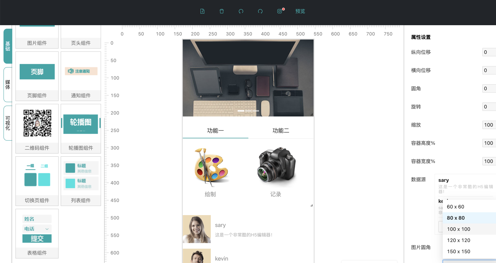

## nuwa-react

nuwa-react 是开源的 H5 可视化编辑器，致力于提供一套简单方便、专业可靠、无限可能的 H5 落地页最佳实践。技术栈以 react+typescrip 为主。



### 启动项目

```
git clone https://github.com/suyuhuan/nuwa-react.git
cd nuwa-react
npm install
npm run serve
```
